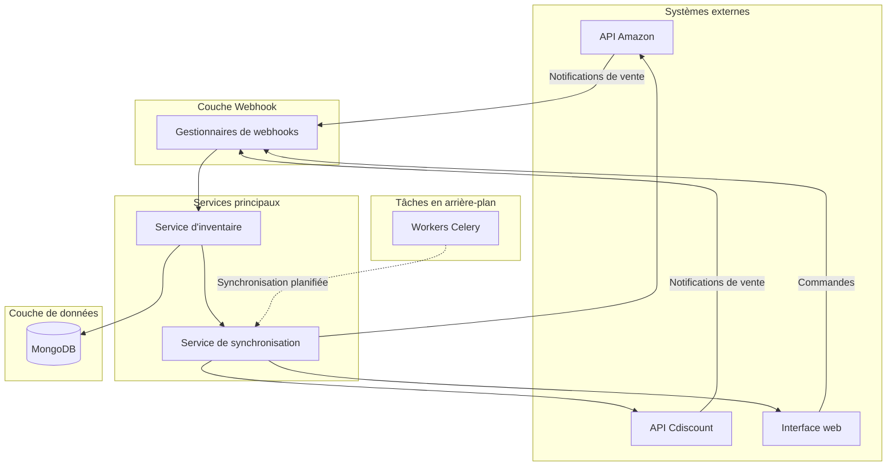
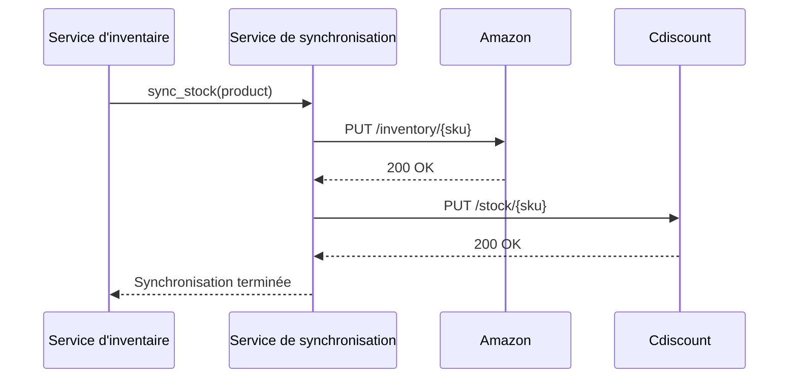
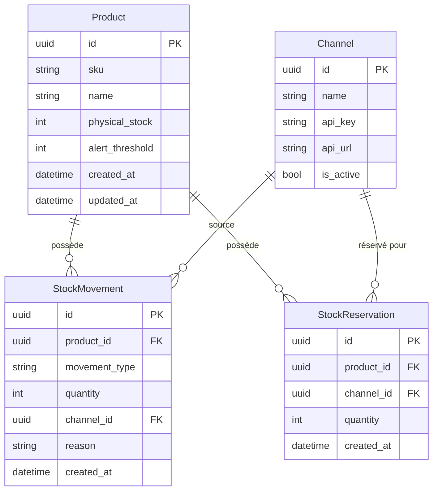
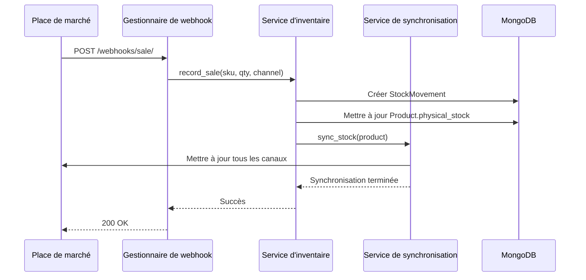
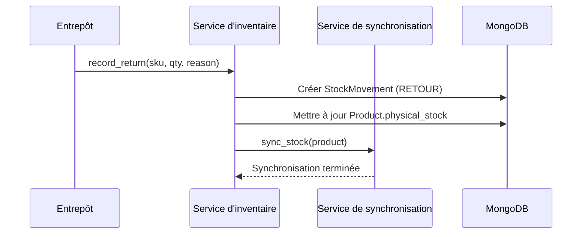

# Architecture StockHub

## Vue d'ensemble du système

StockHub est un système de gestion des stocks multi-canal construit avec Django et MongoDB. Il gère le suivi des stocks, la synchronisation avec les places de marché et le traitement des webhooks pour les opérations e-commerce.

---

## Architecture de haut niveau



---

## Description des composants

### 1. Couche Webhook (`src/webhooks/`)

**Objectif :** Recevoir les callbacks HTTP des places de marché lors de ventes, retours ou autres événements.

**Responsabilités :**
- Analyser les charges utiles des webhooks entrants
- Valider l'authenticité des requêtes
- Router les événements vers les gestionnaires appropriés
- Renvoyer un accusé de réception à la place de marché

**Points d'entrée :**
| Point d'entrée | Objectif |
|----------------|----------|
| `POST /webhooks/sale/` | Traiter les notifications de vente |
| `POST /webhooks/return/` | Traiter les notifications de retour |

---

### 2. Service d'inventaire (`src/inventory/`)

**Objectif :** Logique métier centrale pour la gestion des stocks.

**Responsabilités :**
- Enregistrer les mouvements de stock (ventes, retours, ajustements)
- Maintenir des comptages de stock précis
- Appliquer les règles métier (pas de stock négatif)
- Déclencher les alertes de réapprovisionnement
- Gérer les réservations par canal

**Opérations clés :**
```
record_movement(product, type, quantity, channel, reason)
    → Met à jour le stock
    → Enregistre le mouvement
    → Déclenche la synchronisation
    → Vérifie le seuil d'alerte

get_available_stock(product)
    → Stock physique - Réservé - En transit
```

---

### 3. Service de synchronisation (`src/sync/`)

**Objectif :** Propager les modifications de stock vers tous les canaux de vente.

**Responsabilités :**
- Construire les payloads API pour chaque place de marché
- Appeler les API des places de marché pour mettre à jour les annonces
- Gérer les erreurs API et les tentatives de réessai
- Suivre l'état de synchronisation

**Flux :**


---

### 4. Modèles de données (`src/inventory/models.py`)



---

## Exemples de flux de données

### Flux de traitement des ventes



### Flux de traitement des retours



---

## Stack technologique

| Composant | Technologie |
|-----------|-------------|
| Framework web | Django 4.2 |
| Couche API | Django REST Framework |
| Base de données | MongoDB via djongo |
| File de tâches | Celery avec Redis |
| Client HTTP | requests |

---

## Configuration

L'application est configurée via `src/settings.py` :

- **Base de données :** Chaîne de connexion MongoDB
- **Identifiants des places de marché :** Clés API et URLs pour chaque canal
- **Celery :** URL du broker et paramètres des tâches
- **Journalisation :** Configuration des logs applicatifs

---

## Considérations de déploiement

1. **Mise à l'échelle :** Les gestionnaires de webhooks doivent être horizontalement scalables
2. **Fiabilité :** Les workers Celery nécessitent une surveillance des tâches bloquées
3. **Observabilité :** Les mouvements de stock doivent être journalisés pour audit
4. **Secrets :** Les clés API des places de marché doivent être stockées de manière sécurisée